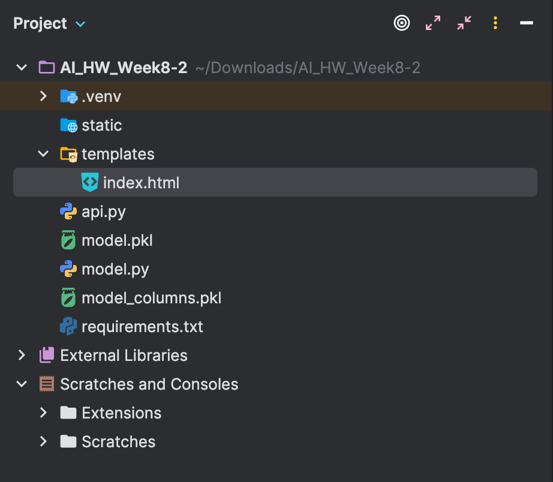
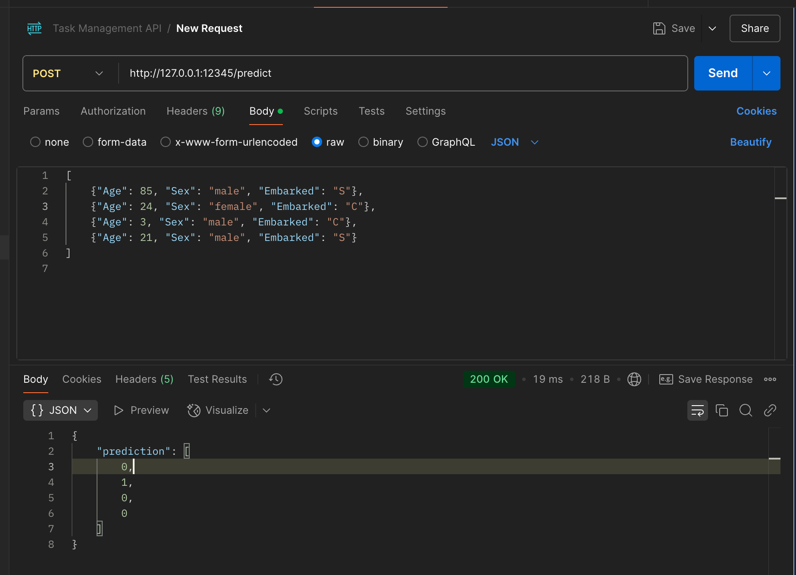
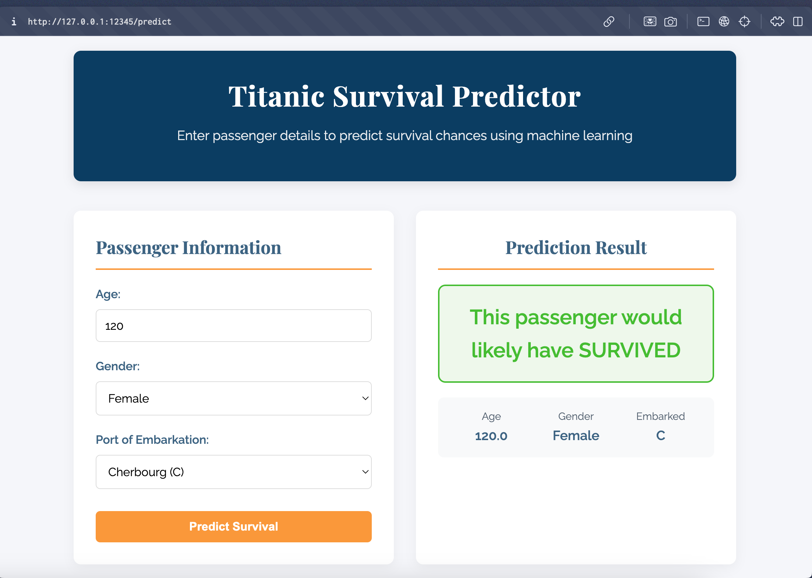
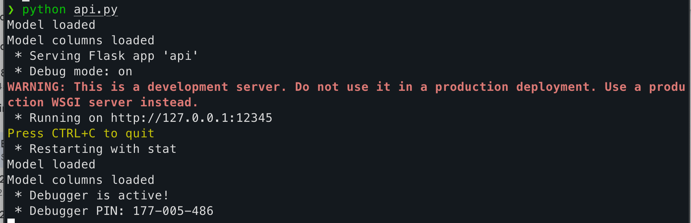

# Titanic Survival Prediction API

A machine learning web application that predicts whether a passenger would have survived the Titanic disaster based on their characteristics. This project combines a Flask API with a beautiful web interface, allowing both programmatic access and user-friendly interaction through a browser.

## Introduction

This application uses a Logistic Regression model trained on the historical Titanic dataset to predict survival probability. The model considers three key factors:

- Age
- Gender
- Port of Embarkation

The project consists of two main components:
1. A machine learning model (`model.py`) that trains and saves the prediction model
2. A Flask web application (`api.py`) that serves both API endpoints and a web interface

## Setup Instructions

### Prerequisites
- Python 3.6 or higher
- pip (Python package manager)

### Installation

1. Clone this repository:
   ```
   git clone <repository-url>
   cd titanic-survival-predictor
   ```

2. Create and activate a virtual environment (optional but recommended):
   ```
   python -m venv .venv
   source .venv/bin/activate  # On Windows: .venv\Scripts\activate
   ```

3. Install the required dependencies:
   ```
   pip install flask pandas scikit-learn joblib
   ```

4. Train the model:
   ```
   python model.py
   ```
   This will create two files: `model.pkl` and `model_columns.pkl`

5. Start the Flask application:
   ```
   python api.py
   ```
   By default, the application will run on port 12345. You can specify a different port by passing it as an argument:
   ```
   python api.py 5000
   ```

## Usage

### Web Interface

Access the web interface by opening a browser and navigating to:
```
http://localhost:12345/
```

The interface allows you to:
1. Enter passenger details (Age, Gender, Port of Embarkation)
2. Submit the form to get a prediction
3. View the prediction result with visual indicators

### API Endpoints

#### Predict Survival

**Endpoint:** `/predict`  
**Method:** POST  
**Content-Type:** application/json  

**Request Body:**
```json
[
  {
    "Age": 25,
    "Sex": "male",
    "Embarked": "S"
  }
]
```

**Response:**
```json
{
  "prediction": [0]
}
```
Where `0` indicates "did not survive" and `1` indicates "survived".

## API Documentation

### Endpoints

| Endpoint | Method | Description |
|----------|--------|-------------|
| `/` | GET | Serves the web interface |
| `/predict` | POST | Accepts passenger data and returns survival prediction |

### Error Handling

The API returns appropriate error messages and status codes when:
- The model hasn't been trained
- The input data is invalid or missing required fields
- An unexpected error occurs during prediction

## Web Interface

The web interface provides a user-friendly way to interact with the prediction model. It features:

- A form for entering passenger details
- Clear visual indicators for prediction results
- Information about the Titanic disaster
- Responsive design that works on both desktop and mobile devices

## Preview Screenshots

### Home Page


### Prediction Form


### Survival Prediction Result


### Non-Survival Prediction Result


## Project Structure

```
titanic-survival-predictor/
├── model.py                # Model training script
├── api.py                  # Flask application
├── model.pkl               # Trained model (generated)
├── model_columns.pkl       # Model columns (generated)
├── templates/              # HTML templates
│   └── index.html          # Web interface
├── previews/               # Screenshot images
└── README.md               # This file
```

## Technologies Used

- **Flask**: Web framework for the API
- **Pandas**: Data manipulation and preprocessing
- **Scikit-learn**: Machine learning model implementation
- **Joblib**: Model serialization
- **HTML/CSS**: Web interface design

## License

This project is licensed under the MIT License - see the LICENSE file for details.